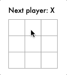

# Day 56

Add custom events, tic tac toe base prototype and function custom element support from [Day 55](../055).

## References

* https://ko.reactjs.org/tutorial/tutorial.html#what-are-we-building
* https://html.spec.whatwg.org/multipage/custom-elements.html#valid-custom-element-name
* https://developer.mozilla.org/en-US/docs/Web/Web_Components/Using_custom_elements#using_the_lifecycle_callbacks
