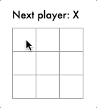

# Day 57

Add working version of tic tac toe game from [Day 56](../056).

## Note

Today I noticed there was *already* framework exists really similar to my project.
I was mimicking [React.js][1] as framework design reference and plus HTML5 [custom elements][2] and [template literals][3] for components.
But, [lit-html](https://github.com/Polymer/lit-html) already achieved everything that I was tried to do perfectly.

That really surprised me but by the purpose of this repository which is improving my programming skills daily, I'll continue building project without looking direct into any source code that already exists. That is ofcourse if I copy source codes it will violates copyright and also It will not gonna be really helpful to improving my skills and gaining experiences during process.

## References

* https://www.w3.org/TR/2011/WD-html5-20110525/syntax.html

[1]: https://reactjs.org/
[2]: https://developer.mozilla.org/en-US/docs/Web/Web_Components/Using_custom_elements
[3]: https://developer.mozilla.org/en-US/docs/Web/JavaScript/Reference/Template_literals.

