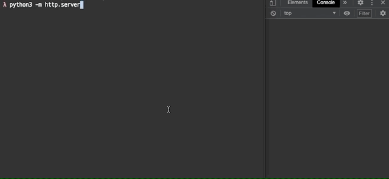

# Day 64

Proof-of-Concept of browsing activity tracking on environment without JavaScript by using CSS.

## References

* https://developer.mozilla.org/ko/docs/Web/HTML/Element/link
* https://developer.mozilla.org/ko/docs/Web/CSS/Pseudo-classes
    * https://developer.mozilla.org/ko/docs/Web/CSS/:active
    * https://developer.mozilla.org/ko/docs/Web/CSS/:hover
