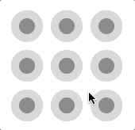
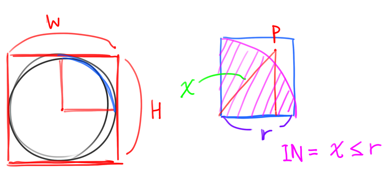

# Day 70

Mobile-like lock pattern on canvas.

## Description

The collision of cursor and each points (which is circular shaped)
can be calculate by using "[Pythagorean theorem](https://en.wikipedia.org/wiki/Pythagorean_theorem)".

## References

* https://developer.mozilla.org/ko/docs/Web/API/Canvas_API/Tutorial/Drawing_shapes
* https://developer.mozilla.org/ko/docs/Web/JavaScript/Reference/Global_Objects/Math/sqrt
