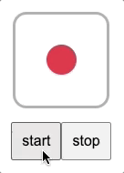

# Day 74

Dice made with DOM by using custom elements.

## References

* sfx
    * https://freesound.org/people/Agaxly/sounds/348959/
* docs
    * flex
        * https://developer.mozilla.org/ko/docs/Web/CSS/flex
        * https://developer.mozilla.org/en-US/docs/Web/CSS/CSS_Flexible_Box_Layout/Basic_Concepts_of_Flexbox
        * https://developer.mozilla.org/en-US/docs/Web/CSS/CSS_Flexible_Box_Layout/Aligning_Items_in_a_Flex_Container
    * animation
        * https://developer.mozilla.org/en-US/docs/Web/CSS/CSS_Animations/Using_CSS_animations
        * https://developer.mozilla.org/en-US/docs/Web/CSS/CSS_Animations/Tips
        * https://developer.mozilla.org/ko/docs/Web/API/AnimationEvent/AnimationEvent
