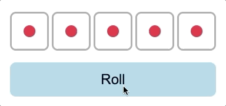

# Day 75

Prototype of [Yacht board game](https://en.wikipedia.org/wiki/Yacht_%28dice_game%29) built with dice from [Day 74](../074).

## Features

* You can hold (or lock) dices by clicking dice after first roll.
* Sound effects:
    * Rolling dices.
    * Applause when achieved "Yacht".

## References

* https://freesound.org/people/AbdrTar/sounds/519419/
* https://freesound.org/people/nickrave/sounds/245639/
* https://developer.mozilla.org/en-US/docs/Web/HTML/Element/table

