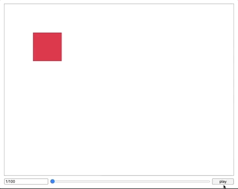

# Day 81

Use CSS animation to generate intermediate state of movement from [Day 80](../080).

## Reference
* https://developer.mozilla.org/en-US/docs/Web/CSS/CSS_Animations/Using_CSS_animations
* https://developer.mozilla.org/en-US/docs/Web/CSS/CSS_Animations/Tips

