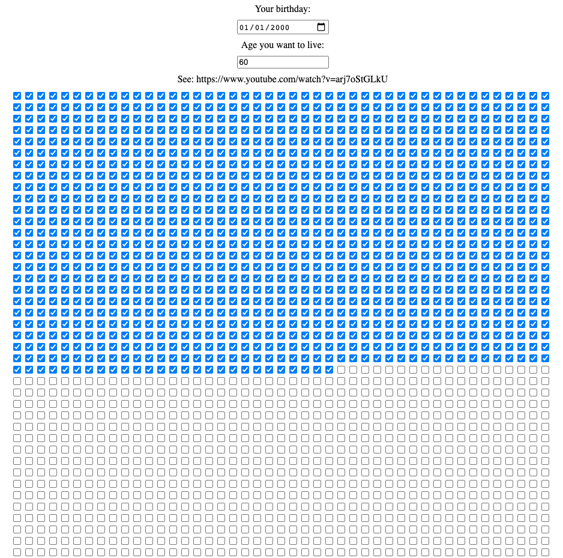

# Day 83

Use media query to make mobile friendly layout and use storage to save user settings from [Day 82](../082).

## References

* https://developer.mozilla.org/en-US/docs/Web/API/Window/localStorage

