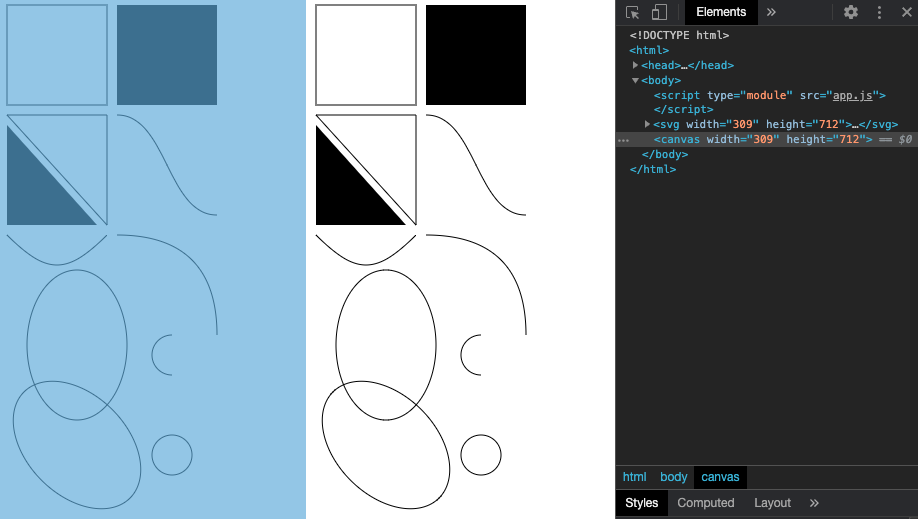
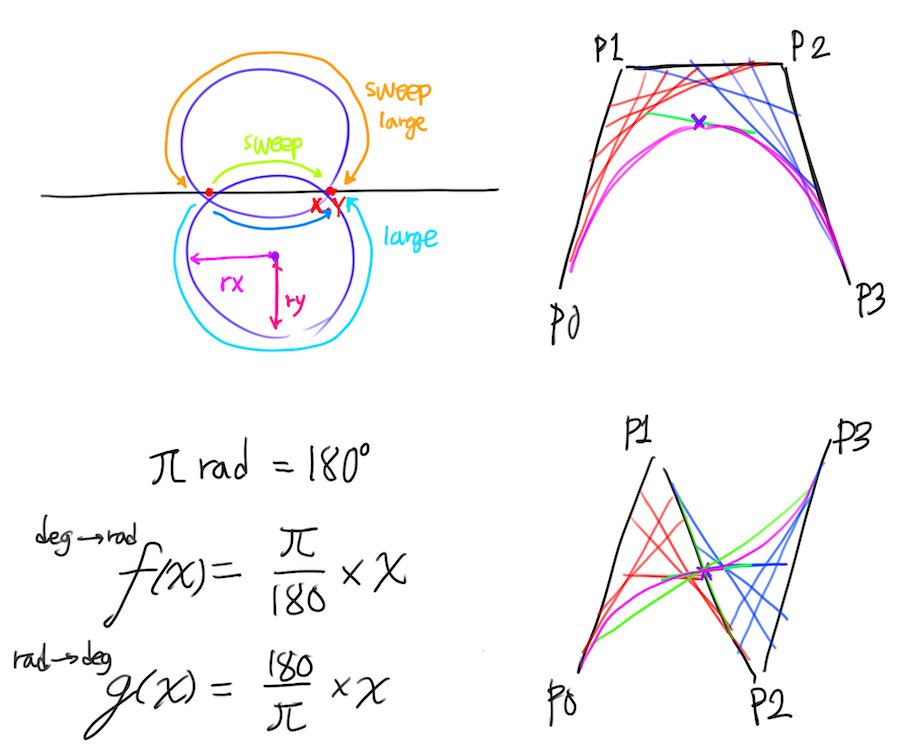

# Day 85

Add arc and complete ellipse implementation from [Day 84](../084).

## Note

## References

* https://developer.mozilla.org/en-US/docs/Web/JavaScript/Reference/Global_Objects/Math/sin
* https://developer.mozilla.org/en-US/docs/Web/JavaScript/Reference/Global_Objects/Math/cos
* https://developer.mozilla.org/en-US/docs/Web/API/CanvasRenderingContext2D/arc
* https://developer.mozilla.org/en-US/docs/Web/API/CanvasRenderingContext2D/ellipse
* https://developer.mozilla.org/en-US/docs/Web/SVG/Element/circle
* https://developer.mozilla.org/en-US/docs/Web/SVG/Attribute/transform
* https://developer.mozilla.org/en-US/docs/Web/SVG/Tutorial/Paths

