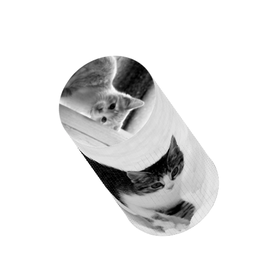

# Day 94

Cat cylinder by using CSS transform.

## References

* http://placekitten.com/
* https://stackoverflow.com/a/9265035
* https://developer.mozilla.org/en-US/docs/Web/CSS/transform-style
* https://developer.mozilla.org/en-US/docs/Web/CSS/transform-function/rotate3d()
* https://developer.mozilla.org/ko/docs/Web/CSS/background
* https://developer.mozilla.org/ko/docs/Web/CSS/background-image
* https://developer.mozilla.org/ko/docs/Web/CSS/background-repeat
* https://developer.mozilla.org/en-US/docs/Web/CSS/background-position

